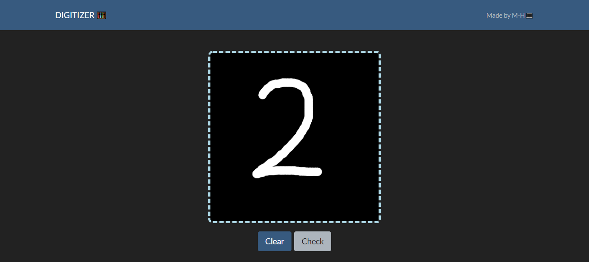
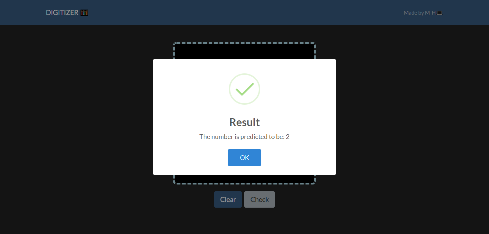

# DIGITIZER

 

     

### ⚡ Made by:

- [Hasham Khalid](https://github.com/Muhammad-Hasham-Khalid)
- [Midha Tahir](https://github.com/MidhaTahir)

### ⚡️ Model Description:

- [Trained Model](https://github.com/MidhaTahir/DEEP_LEARNING_/blob/master/MNIST_DIGIT.ipynb)
- Accuracy on test set: **97.8%**

### ⚡️ Web Preview:

### ⚡️ Give it a Star ⭐️

> Feel free to contribute. Make a PR 🚀

